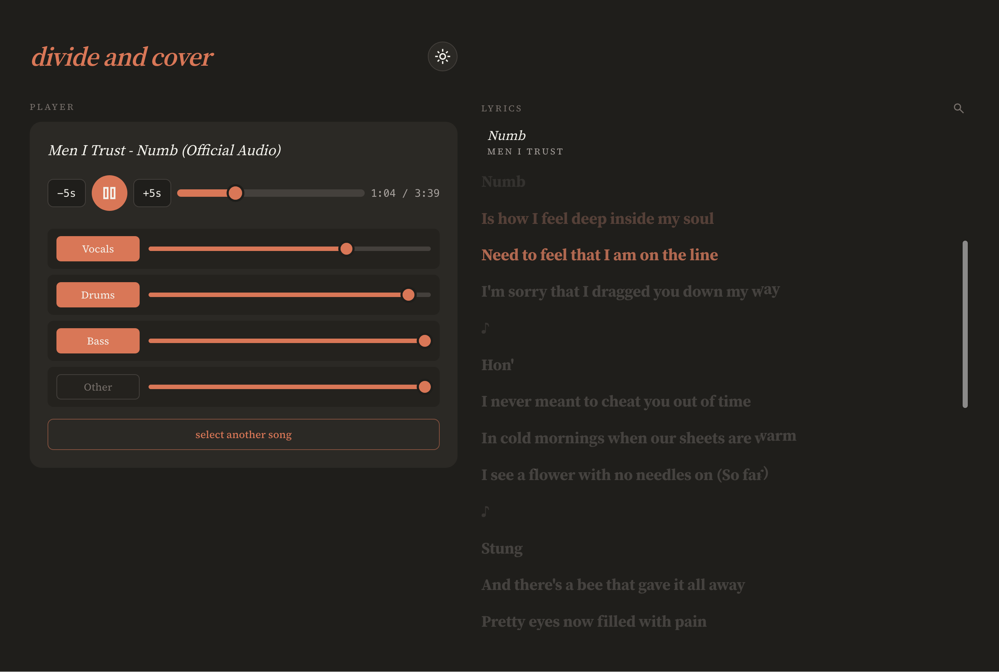
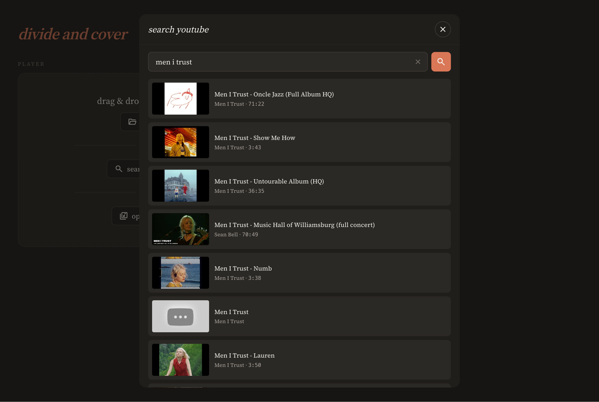

# divide and cover

Drop a song, get four stems. Web UI on top of [demucs](https://github.com/adefossez/demucs).

<p align="center">
  
  
</p>

## Run

Requires [uv](https://docs.astral.sh/uv/) and Python 3.11.

```bash
uv sync
uv run uvicorn app.main:app --host 127.0.0.1 --port 8000
```

Open <http://127.0.0.1:8000>.

Drag any audio file onto the page (or click *browse*). The first split downloads
the `htdemucs` weights into `~/.cache/torch/hub/`; subsequent splits reuse them.
A 3-minute song splits in roughly 30–90 s on Apple Silicon.

## Player

Once split, the four stems (`vocals`, `drums`, `bass`, `other`) play in
sample-accurate sync via the Web Audio API. Click any stem name to mute/unmute,
drag its slider for per-stem volume, the seek bar to scrub, or hit space to
play/pause.

## Library

Past splits show up under the player. Click a track to load it; click `✕` to
delete its folder.

## Storage

Splits live in `tracks/{job_id}/{vocals,drums,bass,other}.mp3` plus a
`meta.json`. The original upload is discarded after the split completes. The
folder is gitignored — clean up via the UI or `rm -rf tracks/`.

## Layout

- `app/main.py` — FastAPI:
  - `POST /api/separate` — shells out to `python -m demucs`, persists stems.
  - `GET /api/tracks` — list past splits.
  - `DELETE /api/tracks/{job_id}` — remove a split.
  - `GET /api/stem/{job_id}/{stem}` — serve a stem mp3.
- `app/static/` — single-page Tailwind (CDN) + vanilla JS frontend.
